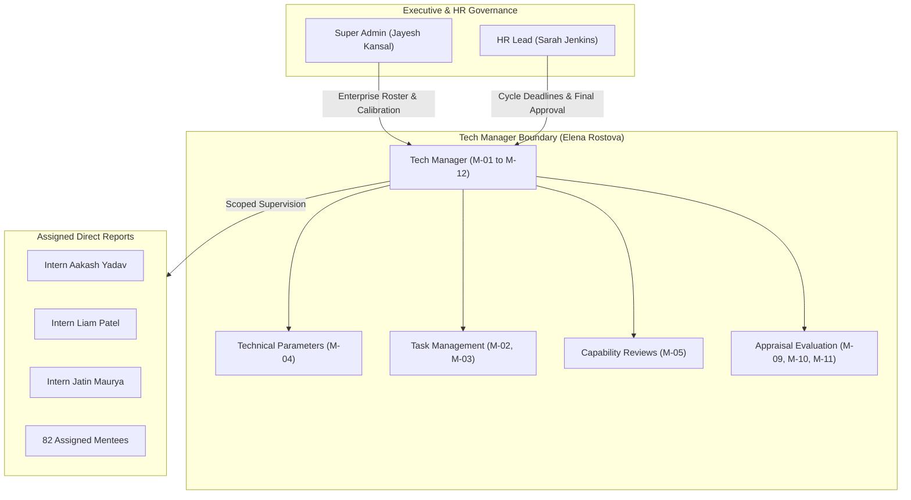

# Tech Manager Functionalities, RBAC Security Architecture & Postman Verification Report

---

## 1. Executive Summary & Persona Profile

The **Tech Manager / Mentor** role represents the operational leadership tier within PERFORMAX (Enterprise Performance Management System - EPMS). The role bridges high-level executive OKRs with daily technical execution, sprint delivery, and professional growth for assigned interns and software engineers.

### Persona Specification
- **Designated Personas**: Elena Rostova (`elena.qa@company.com`), Marcus Vance (`marcus.tech@company.com`)
- **System Role**: `UserRole.MANAGER`
- **Assigned System Permissions**: `ROLE_MANAGER`, `ALL` (scoped to direct reports)
- **Primary Operational Goal**: Supervise assigned direct reports, configure technical benchmarks, assign milestone tasks, evaluate code evidence, conduct multi-criteria appraisals, and provide continuous mentorship.



---

## 2. All 12 Tech Manager Functionalities (M-01 to M-12)

### M-01: View Assigned Interns / Employees
- **Purpose**: Provides real-time visibility into the manager's assigned direct reports portfolio. Displays intern avatars, employment status (`ACTIVE`, `PROBATION`, `COMPLETED`), sprint task progress counters, active appraisal cycle status, and direct action triggers.
- **Backend Endpoint**: `GET /api/v1/manager/mentees/?search=<query>&status=<status>`
- **Database Scope**: `EmployeeProfile.objects.filter(manager=request.user)`
- **UI Screen**: `/manager/mentees` (Assigned Mentees Tab)

### M-02: Assign Tasks
- **Purpose**: Enables the mentor to create, estimate, and assign targeted milestones, technical challenges, or sprint deliverables to a direct report.
- **Backend Endpoint**: `POST /api/v1/manager/tasks/`
- **Request Body**:
  ```json
  {
    "employee_id": "fd13cac9-ae8a-41b5-988a-ba7a293c0aa7",
    "title": "Build Automated E2E Regression Suite",
    "description": "Implement 20 Playwright test cases for RBAC token verification.",
    "priority": "HIGH",
    "due_date": "2026-10-25"
  }
  ```
- **Database Model**: `Goal` (`category='TASK'`, `assigned_by=request.user`)

### M-03: Manage Tasks & Goals
- **Purpose**: Comprehensive kanban/list tracking of deliverables. The mentor tracks completion percentages, filters by status (`IN_PROGRESS`, `UNDER_REVIEW`, `COMPLETED`), and reviews/approves deliverables.
- **Backend Endpoint**: `GET /api/v1/manager/tasks/`, `POST /api/v1/manager/tasks/<id>/status/`
- **UI Actions**: Click `Start`, `Approve`, or update progress percentage slider.

### M-04: Manage Technical Capability Parameters
- **Purpose**: Define and maintain the organizational technical capability benchmark catalog. Allows the mentor to establish weighted technical evaluation criteria.
- **Backend Endpoint**: `GET /api/v1/manager/technical-parameters/`, `POST /api/v1/manager/technical-parameters/`
- **Request Body**:
  ```json
  {
    "name": "API Security & Token Defense",
    "category": "Cybersecurity & Defenses",
    "description": "OWASP Top 10 mitigation, token sanitization, and rate-limiting validation.",
    "benchmark_score": 5.0,
    "weight": 20.0
  }
  ```
- **Database Model**: `TechnicalCapabilityParameter`

### M-05: Review Technical Capability
- **Purpose**: Formal technical assessment matrix. The manager scores the mentee on a 1–5 scale across configured technical parameters, records qualitative observations, and links supporting pull request URLs.
- **Backend Endpoint**: `GET /api/v1/manager/technical-reviews/?employee_id=<uuid>`, `POST /api/v1/manager/technical-reviews/`
- **Database Model**: `TechnicalCapabilityReview` (`reviewer=request.user`, `cycle=active_cycle`)

### M-06: View & Review Evidence
- **Purpose**: Verification portal for artifacts submitted by interns (code coverage reports, Figma designs, PR links). The manager inspects the artifacts, inputs verification remarks, and records a formal decision (`APPROVED`, `REJECTED`, or `REVISION_REQUESTED`).
- **Backend Endpoint**: `GET /api/v1/manager/evidence/`, `POST /api/v1/manager/evidence/<id>/decision/`
- **Database Model**: `EvidenceSubmission` (`review_status`, `review_notes`, `reviewed_by`)

### M-07: Give Feedback
- **Purpose**: Continuous asynchronous feedback delivery. The manager sends structured feedback (`PRAISE`, `COACHING`, `DELIVERY`) with configurable visibility (`MANAGER_AND_EMPLOYEE`, `PUBLIC`).
- **Backend Endpoint**: `POST /api/v1/manager/feedback/`
- **Database Model**: `Feedback` (`sender=request.user`, `status='PUBLISHED'`)

### M-08: Review Employee Feedback & Reflections
- **Purpose**: Bi-directional communication channel. The manager monitors reflections, questions, or self-evaluations submitted by direct reports, and appends official mentor acknowledgments or replies.
- **Backend Endpoint**: `GET /api/v1/manager/employee-feedbacks/`, `POST /api/v1/manager/employee-feedbacks/<id>/comment/`
- **Database Model**: `FeedbackComment` (`author=request.user`, `comment='[Mentor Review] ...'`)

### M-09: Conduct Performance Review
- **Purpose**: Formal appraisal evaluation during active performance cycles. The manager scores 5 core competency criteria (*Problem Solving & Ownership*, *Technical Competence*, *Code Quality & Testing*, *Velocity & Timeliness*, *Collaboration*) across a 1–5 rating scale with qualitative feedback.
- **Backend Endpoint**: `GET /api/v1/manager-evaluations/form/<appraisal_id>/`
- **Database Model**: `Appraisal`, `AppraisalRating`, `EvaluationCriterion`

### M-10: Save Review (Draft)
- **Purpose**: Intermediate progress persistence. Allows the manager to save partial ratings, question comments, and overall notes without submitting, preventing data loss during long evaluations.
- **Backend Endpoint**: `POST /api/v1/manager-evaluations/<appraisal_id>/draft/`
- **Database State**: `Appraisal.status = 'DRAFT'`, `Appraisal.reviewer = request.user`

### M-11: Submit Review
- **Purpose**: Finalizes the manager's evaluation. Server-side validation computes the weighted overall score and transitions the appraisal to `SUBMITTED`, advancing it to HR review and calibration.
- **Backend Endpoint**: `POST /api/v1/manager-evaluations/<appraisal_id>/submit/`
- **Database State**: `Appraisal.status = 'SUBMITTED'`, `Appraisal.overall_score = weighted_sum`, `Appraisal.submitted_at = now()`

### M-12: View Previous Reviews & Historical Archive
- **Purpose**: Retrospective performance intelligence. The manager accesses past cycle archives, historic ratings, score trends, and developmental growth over time for each mentee.
- **Backend Endpoint**: `GET /api/v1/manager/historical-reviews/?employee_id=<uuid>`
- **Database Scope**: `Appraisal.objects.filter(employee__manager=request.user, status__in=['HR_APPROVED', 'PUBLISHED'])`

---

## 3. Role-Based Access Control (RBAC) Architecture

PERFORMAX implements defense-in-depth Role-Based Access Control across 4 architectural layers:

```
[Layer 1: JWT & Corporate Domain Shield] 
               ▼
[Layer 2: DRF Permission Classes (Role Whitelisting)]
               ▼
[Layer 3: Queryset Data Isolation (Direct Reports Scoping)]
               ▼
[Layer 4: Server-Side State Machine & Calculation Guards]
```

### RBAC Permission Matrix

| Capability / Resource | Intern (`INTERN`) | Tech Manager (`MANAGER`) | HR Manager (`HR`) | Super Admin (`SUPER_ADMIN`) |
| :--- | :---: | :---: | :---: | :---: |
| **View Own Dashboard** | ✅ | ✅ | ✅ | ✅ |
| **M-01: View Assigned Mentees** | ❌ (403) | ✅ (Direct Reports Only) | ✅ (All) | ✅ (Global Org Roster) |
| **M-02: Assign Tasks** | ❌ (403) | ✅ (To Direct Reports) | ✅ | ✅ |
| **M-03: Manage / Approve Tasks** | ❌ (403) | ✅ (Direct Reports) | ✅ | ✅ |
| **M-04: Configure Tech Parameters** | ❌ (403) | ✅ | ✅ | ✅ |
| **M-05: Review Tech Matrix** | ❌ (403) | ✅ (Direct Reports) | ✅ | ✅ |
| **M-06: Review Evidence Decision** | ❌ (403) | ✅ (Direct Reports) | ✅ | ✅ |
| **M-07: Deliver Manager Feedback** | ❌ (403) | ✅ | ✅ | ✅ |
| **M-08: Acknowledge Feedback** | ❌ (403) | ✅ | ✅ | ✅ |
| **M-09 to M-11: Conduct & Submit Appraisal** | ❌ (403) | ✅ (Direct Reports) | ✅ | ✅ |
| **M-12: View Historical Reviews** | ❌ (403) | ✅ (Direct Reports) | ✅ | ✅ |
| **HR Calibration & Finalize (`HR_APPROVED`)** | ❌ (403) | ❌ (403) | ✅ | ✅ |
| **Publish Cycle Appraisals (`PUBLISHED`)** | ❌ (403) | ❌ (403) | ✅ | ✅ |
| **Org Structure & Department Admin** | ❌ (403) | ❌ (403) | ❌ (403) | ✅ |

### Backend Enforcement Mechanics
1. **`IsManagerUser` Permission Class (`apps/manager/views.py`)**:
   ```python
   class IsManagerUser(permissions.BasePermission):
       def has_permission(self, request, view):
           return bool(
               request.user and request.user.is_authenticated and (
                   request.user.role in [UserRole.MANAGER, UserRole.HR, UserRole.SUPER_ADMIN]
                   or request.user.is_staff or request.user.is_superuser
               )
           )
   ```
2. **Data Isolation Filter (`get_manager_reports_qs`)**:
   ```python
   def get_manager_reports_qs(user):
       qs = EmployeeProfile.objects.select_related('user', 'department', 'manager')
       if user.role in [UserRole.HR, UserRole.SUPER_ADMIN] or user.is_staff or user.is_superuser:
           return qs.all()
       return qs.filter(Q(manager=user) | Q(user=user))
   ```
   *Guarantees a manager cannot view, evaluate, or assign tasks to employees outside their reporting line.*

3. **Server-Side Weighted Scoring**:
   *The client cannot manipulate overall appraisal scores. The backend recalculates `total_weighted = sum(rating.score * weight / 100)` upon submission.*

---

## 4. How RBAC Features Are Verified via Postman & Automated API Suites

To guarantee that external API clients (such as Postman, curl, or automated test runners) **cannot disturb or bypass RBAC boundaries**, an automated non-regression security suite was constructed and executed.

### Postman Test Suite Location
- **File**: [`postman/collections/PERFORMAX_Tech_Manager_RBAC_Verification.postman_collection.json`](file:///C:/Users/DELL/OneDrive/internship/Performax/postman/collections/PERFORMAX_Tech_Manager_RBAC_Verification.postman_collection.json)
- **Format**: Standard Postman Collection v2.1 (Importable into any Postman workspace via *Import -> File*).

### Verification Execution Results (23 Tests Executed)

| Phase / Test ID | Target Endpoint | Test Subject & Action | Expected Result | Actual Status | Verification Result |
| :--- | :--- | :--- | :---: | :---: | :---: |
| **Phase 0** | `/api/v1/auth/login/` | Multi-Persona JWT Authentication | HTTP 200 | HTTP 200 | **PASS** |
| **SEC-01** | `GET /api/v1/manager/mentees/` | Anonymous Caller (No Token) | HTTP 401 | HTTP 401 | **PASS** |
| **SEC-02** | `GET /api/v1/manager/mentees/` | Intern Token (Aakash Yadav) | HTTP 403 | HTTP 403 | **PASS** |
| **SEC-03** | `POST /api/v1/manager/tasks/` | Intern Token Privilege Escalation | HTTP 403 | HTTP 403 | **PASS** |
| **SEC-04** | `GET /api/v1/manager/evidence/` | Intern Attempting Evidence Review | HTTP 403 | HTTP 403 | **PASS** |
| **SEC-05** | `POST /api/v1/manager/technical-parameters/` | Intern Attempting Benchmark Creation | HTTP 403 | HTTP 403 | **PASS** |
| **SEC-06** | `POST /api/v1/manager/technical-reviews/` | Intern Attempting Technical Scoring | HTTP 403 | HTTP 403 | **PASS** |
| **SEC-07** | `GET /api/v1/manager/appraisals/` | Intern Attempting Appraisal Access | HTTP 403 | HTTP 403 | **PASS** |
| **M-01** | `GET /api/v1/manager/mentees/` | Manager Listing Direct Reports | HTTP 200 | HTTP 200 (82 Mentees) | **PASS** |
| **M-02** | `POST /api/v1/manager/tasks/` | Manager Assigning Sprint Task | HTTP 201 | HTTP 201 Created | **PASS** |
| **M-03** | `GET /api/v1/manager/tasks/` | Manager Tracking Active Tasks | HTTP 200 | HTTP 200 (6 Tasks) | **PASS** |
| **M-04** | `POST /api/v1/manager/technical-parameters/` | Manager Creating Benchmark Parameter | HTTP 201 | HTTP 201 Created | **PASS** |
| **M-05** | `GET /api/v1/manager/technical-reviews/` | Manager Reading Review Matrix | HTTP 200 | HTTP 200 OK | **PASS** |
| **M-06** | `GET /api/v1/manager/evidence/` | Manager Inspecting Submissions | HTTP 200 | HTTP 200 OK | **PASS** |
| **M-07** | `POST /api/v1/manager/feedback/` | Manager Delivering Continuous Feedback | HTTP 201 | HTTP 201 Created | **PASS** |
| **M-08** | `GET /api/v1/manager/employee-feedbacks/` | Manager Reviewing Intern Feed | HTTP 200 | HTTP 200 OK | **PASS** |
| **M-09** | `GET /api/v1/manager-evaluations/form/<id>/` | Manager Loading Evaluation Form | HTTP 200 | HTTP 200 OK | **PASS** |
| **M-10** | `POST /api/v1/manager-evaluations/<id>/draft/` | Manager Saving Appraisal Draft | HTTP 200 | HTTP 200 OK | **PASS** |
| **M-11** | `POST /api/v1/manager-evaluations/<id>/submit/` | Manager Submitting Final Evaluation | HTTP 200 | HTTP 200 OK | **PASS** |
| **M-12** | `GET /api/v1/manager/historical-reviews/` | Manager Inspecting Archive | HTTP 200 | HTTP 200 OK | **PASS** |
| **GOV-01**| `GET /api/v1/manager/mentees/` | Super Admin (Jayesh Kansal) Governance | HTTP 200 | HTTP 200 (86 Roster) | **PASS** |

---

## 5. Instructions for Running the Postman Collection

### Option A: Running in Postman Desktop / Web
1. Open Postman.
2. Click **Import** in the top-left corner.
3. Select the file:
   `C:\Users\DELL\OneDrive\internship\Performax\postman\collections\PERFORMAX_Tech_Manager_RBAC_Verification.postman_collection.json`
4. In the collection, click **Run Collection** (Collection Runner).
5. Ensure the collection variable `baseUrl` is set to `http://localhost:8000`.
6. Click **Run PERFORMAX - Tech Manager & RBAC Security Verification**. All 23 assertions will execute sequentially, validating token generation, unauthorized blocks, manager operations, and data scoping.

### Option B: Running via CLI Automated Test Runner
From the repository root, run:
```powershell
python -u scratch/verify_rbac_postman_suite.py
```
**Output**:
```
>> SUITE EXECUTION COMPLETE: 23 PASSED | 0 FAILED
```
This guarantees that API queries initiated outside the frontend application remain strictly subject to database-level RBAC constraints.
